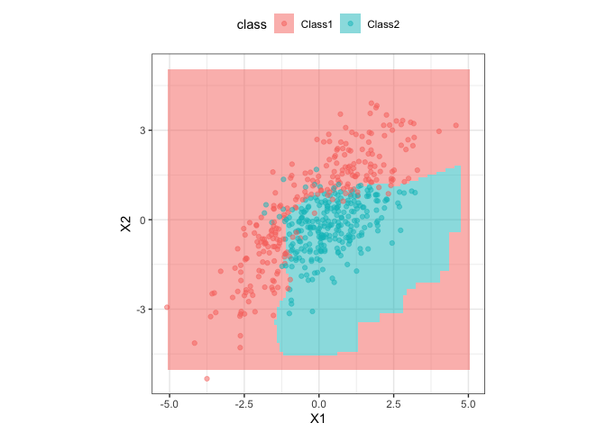

<!-- README.md is generated from README.Rmd. Please edit that file -->

# tidykda

`tidykda` provides a very simple binding to enable the `parsnip` package
to fit a kernel discriminant analysis model for classification by
wrapping the `ks` package.

## Installation

`tidykda` is not available on CRAN, but can be installed (without the
need for Rtools) using the `remotes` package:

``` r
remotes::install_github("jmarshallnz/tidykda")
```

## Example

Here is a simple example using a simulated two-class data set from the
`discrim` package:

``` r
library(tidykda)
#> Loading required package: parsnip
library(discrim)
library(ggplot2)

parabolic_grid <- 
kda_mod <-
  discrim_kernel() %>%
  fit(class ~ ., data = parabolic)

parabolic_grid <-
  expand.grid(X1 = seq(-5, 5, length = 100),
              X2 = seq(-5, 5, length = 100))

parabolic_grid$class <-
  predict(kda_mod, parabolic_grid)$.pred_class

ggplot(parabolic, aes(x = X1, y = X2)) +
  geom_tile(data = parabolic_grid, aes(fill = class), alpha=0.5) +
  geom_point(aes(col = class), alpha = .5) +
  theme_bw() +
  theme(legend.position = "top") +
  coord_equal()
```



## Contributing

If you think you have encountered a bug, please [submit an
issue](https://github.com/jmarshallnz/tidykda/issues).
